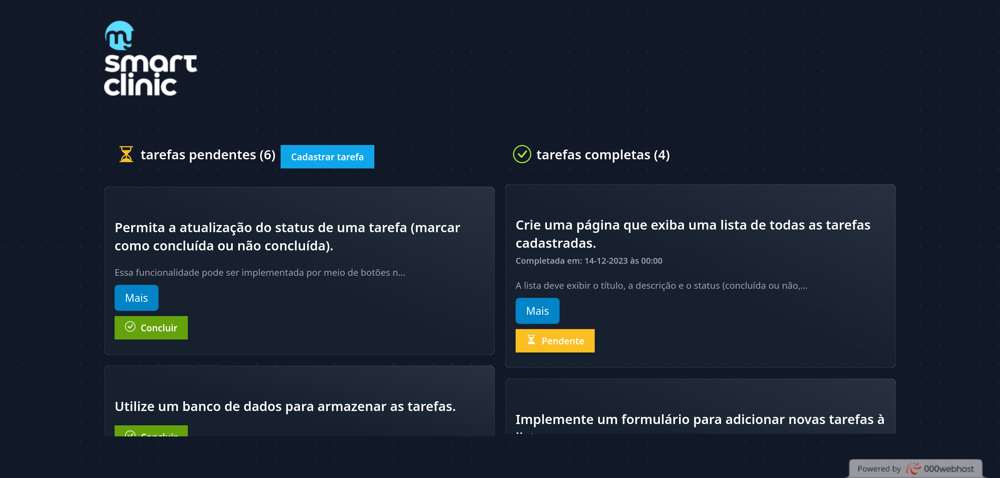
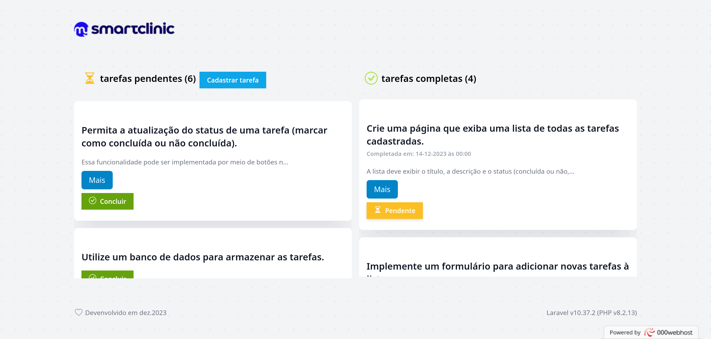

<p align="center"></p>

# Lista de afazeres

Projeto destino para o teste da My Smart Clinic de desenvolvedor back-end. A [descrição] pode ser vista no arquivo [TASK.md][descrição]

## Guia de instalação da aplicação

1. Clonar o projeto
    ```
    $ git clone git@github.com:netojocelino/my-smart-clinical-laravel.git
    $ cd my-smart-clinical-laravel
    ```

1. Realizar a instalação dos pacotes do [composer], caso instale pacotes de desenvolvimento é possível utilizar [Docker]
    ```
    $ composer install --no-dev # Para instalação apenas de pacotes de produção
    $ composer install # Para instalação com pacotes de desenvolvimento
    ```

1. Criar o arquivo .env para determinar as variáveis de ambiente basta copiar o arquivo .env.example
    ```
    $ cp .env{.example,}
    ```

1. Gerar a chave de configuração da aplicação
    ```
    $ php artisan key:generate
    $ ./vendor/bin/sail artisan key:generate # Para execução utilizando sail (necessário [Docker])
    ```


1. Realizar as migrações das tabelas
    ```
    $ php artisan migrate
    $ ./vendor/bin/sail artisan migrate # Para execução utilizando sail (necessário [Docker])
    ```

1.  *(Opcional)* Realizar o preenchimento com alguns dados de tarefas
    ```
    $ php artisan db:seed
    $ ./vendor/bin/sail artisan db:seed # Para execução utilizando sail (necessário [Docker])
    ```

1.  Executar a aplicação
    ```
    $ php artisan serve # Para execução de produção
    $ ./vendor/bin/sail up # Para execução utilizando sail (necessário [Docker])
    ```

    O aplicativo estará disponível na página http://localhost:8080.

1.  *(Opcional)* Executar testes, quando está com pacote de desenvolvimento
    ```
    $ php artisan test --testdox
    $ ./vendor/bin/sail artisan test --testdox # Para execução utilizando sail (necessário [Docker])
    ```

## Decisões de tecnologias

Para desenvolvimento foi escolhido o uso de [Tailwind CSS] para o desenvolvimento da interface gráfica, por praticidade de utilizar as classes de CSS invés de criar arquivos de CSS.

Para uma possível melhoria na aplicação, foi realizado um redirecionamento para a página raiz do site direcionar para uma tela que listará todos os cartões públicos. Permitindo que seja adicionado uma tela de informações sobre o projeto ou até outras informações.

Como [requisito técnico] foi definido utilizar Laravel, então foi utilizado a [versão 10 do Laravel].


## Tela

| Tela em Modo Escuro | Tela em Modo Claro |
| - | - |
|  |  |

[composer]: https://getcomposer.org/
[Docker]: https://docs.docker.com/
[requisito técnico]: .github/TASK.md#utilização-do-laravel
[descrição]: .github/TASK.md
[Tailwind CSS]: https://tailwindcss.com/
[versão 10 do Laravel]: https://laravel.com/docs/10.x/
